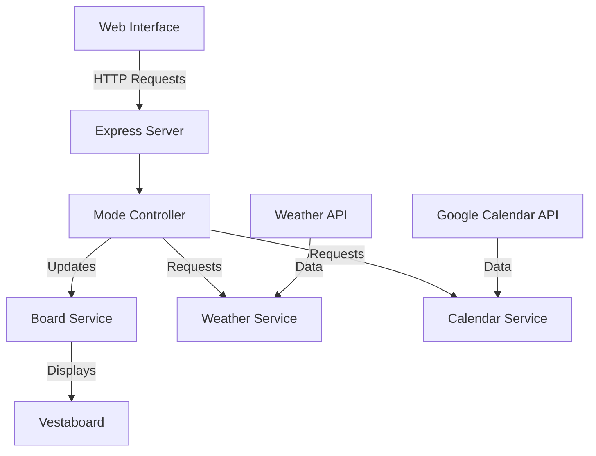

API: https://docs.vestaboard.com/docs/read-write-api/endpoints/
Inspo: https://github.com/pathikrit/my-vestaboard/tree/master

# Project Architecture

This is a Node.js application that controls a Vestaboard display with various modes and integrations. The application serves as a bridge between different data sources (weather, calendar, etc.) and your Vestaboard display.

## System Overview

## Core Components

### 1. Express Server (`src/app.js`)
The application's entry point that handles:
- Static file serving for the web interface
- API endpoints for mode control and status
- OAuth flow for Google Calendar integration
- Debug mode toggling
- Calendar event fetching

### 2. Mode System
The application supports multiple display modes (`src/types/Mode.js`):
- **MANUAL**: Direct control of the display
- **CLOCK**: Shows current time
- **WEATHER**: Displays weather information
- **CALENDAR**: Shows upcoming calendar events

### 3. Services

#### Board Service (`src/services/boardService.js`)
- Handles direct communication with the Vestaboard API
- Manages message formatting and display
- Includes debug mode for testing

#### Weather Service (`src/services/weatherService.js`)
- Fetches weather data from weather API
- Formats weather information for display

#### Calendar Service (`src/services/calendarService.js`)
- Manages Google Calendar integration
- Handles OAuth2 authentication
- Retrieves and formats calendar events

#### Token Service (`src/services/tokenService.js`)
- Manages authentication tokens
- Handles token storage and retrieval
- Provides token clearing functionality

### 4. Controllers

#### Mode Controller (`src/controllers/modeController.js`)
- Manages switching between different display modes
- Coordinates updates between services
- Ensures proper mode transitions

### 5. Utilities
Located in `src/utils/`:
- **weatherFormatter.js**: Formats weather data for display
- **calendarFormatter.js**: Formats calendar events for display

## Web Interface
The application includes a web interface (`src/public/`) that allows users to:
- Switch between different display modes
- View current status
- Toggle debug mode
- Manage Google Calendar authentication

## Authentication
- Google Calendar integration uses OAuth2
- Authentication flow is handled through dedicated endpoints
- Tokens are securely stored and managed

## Configuration
- Environment variables are used for sensitive configuration
- Example configuration provided in `.env.example`
- Supports customizable port settings

## Getting Started

1. Clone the repository
2. Copy `.env.example` to `.env` and fill in required values
3. Install dependencies: `npm install`
4. Start the server: `npm start`
5. Access the web interface at `http://localhost:3000`

## API Endpoints

- `GET /api/status`: Get current mode and debug status
- `POST /api/mode`: Change display mode
- `POST /api/debug/toggle`: Toggle debug mode
- `GET /auth/google`: Start Google OAuth flow
- `GET /auth/google/callback`: OAuth callback handler
- `GET /calendar/events`: Fetch calendar events
- `POST /auth/google/clear`: Clear calendar authentication

## Security Considerations

- OAuth tokens are securely stored
- Environment variables used for sensitive data
- No sensitive data exposed in client-side code

