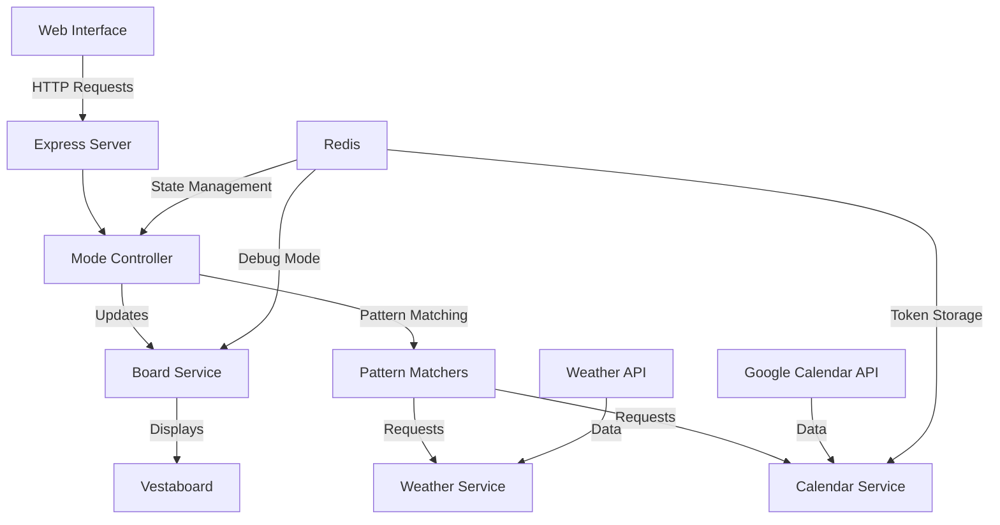

# Project Architecture

This is a Node.js application that controls a Vestaboard display. The application serves as a bridge between different data sources (weather, calendar, etc.) and your Vestaboard display.

I host this app at [Railway](https://railway.com/), but any place you can have host a Node.js server will work. Additionally, I use [Upstash](https://upstash.com/) for Redis.

## System Overview

## Core Components

### 1. Express Server (`src/app.js`)
The application's entry point that handles:
- Static file serving for the web interface
- RESTful API endpoints for board control
- OAuth2 flow for Google Calendar integration
- Environment validation and configuration
- Error handling and logging

### 2. Mode System
The mode system is split across multiple components:
- **Mode Types** (`src/types/Mode.js`): Defines available display modes
- **Mode Controller** (`src/controllers/modeController.js`): Manages mode switching and scheduling
- **Pattern Matchers** (`src/patterns/`): Implements display logic for each mode
- **Redis Integration**: Persists mode state and configuration

The application supports multiple display modes:
- **MANUAL**: Direct control of the display through text input
- **CLOCK**: Shows current time in PST/PDT
- **WEATHER**: Displays 6-day weather forecast with temperature and conditions
- **CALENDAR**: Shows upcoming calendar events within a 7-day window

### 3. Pattern Matcher System (`src/patterns/`)
A flexible system that handles the display logic for each mode:
- **Base Pattern Matcher** (`src/types/PatternMatcher.js`): Defines the interface
- **Weather Pattern Matcher**: Formats and displays weather forecasts
- **Calendar Pattern Matcher**: Formats and displays calendar events
- **Clock Pattern Matcher**: Handles time display
- **Pattern Matcher Factory**: Creates appropriate matcher instances

### 4. Services

#### Board Service (`src/services/boardService.js`)
- Manages communication with the Vestaboard API
- Handles character mapping and board formatting
- Supports debug mode with console visualization
- Provides real-time board content retrieval
- Implements message validation and error handling
- Uses Redis to persist debug mode state

#### Weather Service (`src/services/weatherService.js`)
- Integrates with National Weather Service API
- Provides detailed weather forecasts for specific coordinates
- Handles daytime/nighttime period filtering
- Includes precipitation probability and wind speed data
- Implements error handling and data validation

#### Calendar Service (`src/services/calendarService.js`)
- Full Google Calendar API integration
- Supports multiple calendar synchronization
- Filters all-day and declined events
- Handles timezone conversion (PST/PDT)
- Implements OAuth2 authentication flow
- Uses Redis for secure token storage and management

### 5. Utilities
Located in `src/utils/`:
- **boardCharacters.js**: Manages Vestaboard character mapping
- **cronSchedules.js**: Defines scheduling patterns for different modes
- **redisClient.js**: Handles Redis connection and operations

### 6. State Management
The application uses Upstash Redis for:
- Persisting current display mode
- Storing debug mode state
- Managing OAuth tokens securely
- Maintaining application state across restarts

## Web Interface
The application includes a web interface (`src/public/`) that provides:
- Real-time mode switching
- Current board status display
- OAuth2 authentication management
- Debug mode configuration
- Direct message input for manual mode

## Authentication
- Google Calendar integration uses OAuth2
- Authentication flow is handled through dedicated endpoints
- Tokens are securely stored in Redis

## Configuration
- Environment variables are used for sensitive configuration
- Example configuration provided in `.env.example`
- Supports customizable port settings

## Getting Started

1. Clone the repository
2. Copy `.env.example` to `.env` and fill in required values
3. Install dependencies: `npm install`
4. Start the server: `npm start`
5. Access the web interface at `http://localhost:3000`

## Environment Variables Setup

To run this application, you need to set up several environment variables. Create a `.env` file in the root directory using `.env.example` as a template.

### Required Environment Variables:

1. **Vestaboard API Configuration**
   - `VESTABOARD_READ_WRITE_API_KEY`: Your Vestaboard read/write API key from [Vestaboard Developer Portal](https://www.vestaboard.com/developer)
   - `VESTABOARD_KEY`: Your Vestaboard application key
   - `VESTABOARD_SECRET`: Your Vestaboard application secret
   - `VESTABOARD_DEBUG`: Set to `true` for debug mode (optional)

2. **Redis Configuration**
   - `UPSTASH_REDIS_REST_URL`: Your Upstash Redis REST URL
   - `UPSTASH_REDIS_REST_TOKEN`: Your Upstash Redis REST authentication token

3. **Google Calendar Integration**
   - `GOOGLE_CLIENT_ID`: OAuth 2.0 client ID from Google Cloud Console
   - `GOOGLE_CLIENT_SECRET`: OAuth 2.0 client secret from Google Cloud Console
   - `GOOGLE_REDIRECT_URI`: OAuth redirect URI (typically `http://localhost:3000/auth/google/callback` for local development)

4. **Debug Mode**
   - `NODE_DEBUG`: Set to `true` for additional debugging information (optional)

### How to Obtain the Credentials

1. **Vestaboard Credentials**:
   - Visit the [Vestaboard Developer Portal](https://www.vestaboard.com/developer)
   - Create a new application
   - Copy the provided API key, application key, and secret

2. **Upstash Redis Credentials**:
   - Sign up at [Upstash](https://upstash.com/)
   - Create a new Redis database
   - Copy the REST URL and REST token from your database settings

3. **Google Calendar Credentials**:
   - Go to [Google Cloud Console](https://console.cloud.google.com)
   - Create a new project
   - Enable the Google Calendar API
   - Configure the OAuth consent screen
   - Create OAuth 2.0 credentials
   - Add authorized redirect URIs
   - Complete the OAuth flow to obtain access and refresh tokens

## API Endpoints

- `GET /api/status`: Get current mode and debug status
- `POST /api/mode`: Change display mode
- `POST /api/debug/toggle`: Toggle debug mode
- `GET /auth/google`: Start Google OAuth flow
- `GET /auth/google/callback`: OAuth callback handler
- `GET /calendar/events`: Fetch calendar events
- `POST /auth/google/clear`: Clear calendar authentication

