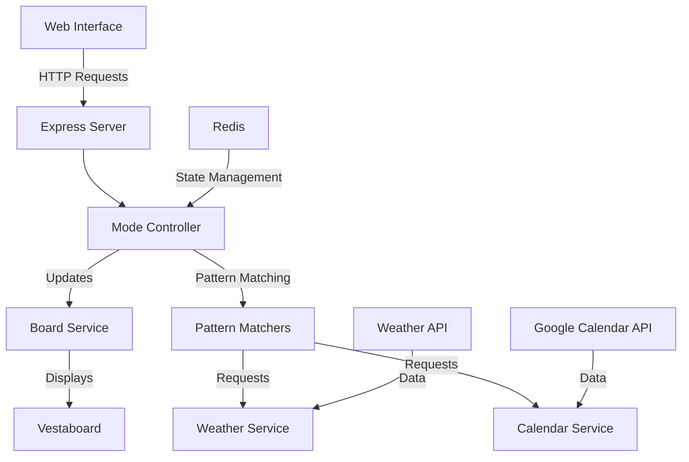

# Vestaboard Server

A Node.js application that controls a Vestaboard display, integrating with various data sources to show different types of content.

## System Overview

## Features

### Display Modes
- **MANUAL**: Direct text input and custom patterns
- **TODAY**: Today's condensed weather summary and birthdays (coming soon)
- **1DAYWEATHER** (Hourly Weather): Current date with hourly weather forecast
- **5DAYWEATHER** (5-Day Weather): 5-day weather forecast
- **CALENDAR**: Upcoming events from Google Calendar
- **CLOCK**: Current time in PST/PDT

### Key Components
- Pattern matching system for content validation
- Redis-based state management
- Web interface for control and monitoring
- Debug mode with console visualization
- Automatic mode scheduling

## Setup

1. Clone the repository
2. Copy `.env.example` to `.env`
3. Configure environment variables:
   - Vestaboard API credentials from [Developer Portal](https://www.vestaboard.com/developer)
   - Upstash Redis credentials
   - Google Calendar OAuth2 credentials
4. Install dependencies: `npm install`
5. Start the server: `npm start`
6. Access web interface: `http://localhost:3000`

## Hosting

The app can be hosted on any Node.js platform. [Railway](https://railway.com/) recommended for deployment, [Upstash](https://upstash.com/) for Redis.
